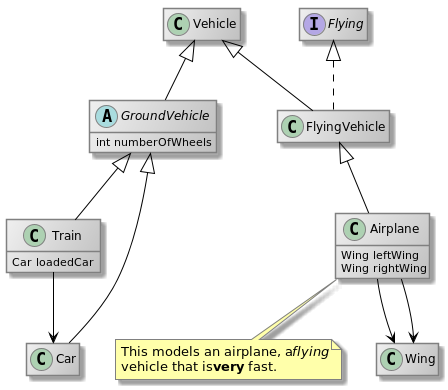
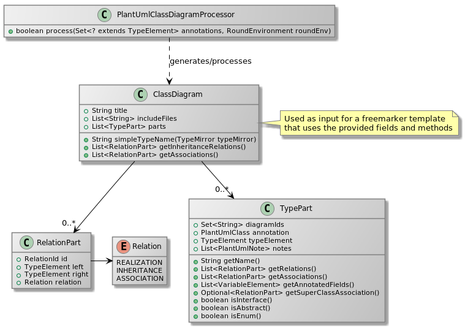

:imagesdir: ./doc/images
:imagesoutdir: ./doc/images

ifdef::env-github[]
:tip-caption: :bulb:
:note-caption: :information_source:
:important-caption: :heavy_exclamation_mark:
:caution-caption: :fire:
:warning-caption: :warning:
endif::[]

ifndef::env-github[]
:icons: font
endif::[]

:toc:
:toc-placement!:

== Living Documentation Lab

=== Motivation
Documentation is hard. Every programmer knows this. It's also boring and repetitive, and the result often looks ugly
and is hard to read (because not all programmers are poets). The fact that written documentation is usually outdated
before it has been finished doesn't make it any better.
                                                        
Therefore, writing documentation it is usually something programmers try to avoid.

There is a simple truth you will often hear when talking to programmers about documentation: the most accurate
documentation is the code itself. It's the only thing that won't become outdated, won't lie to you, and will always be
complete.

But code is difficult to understand. If you have ever tried to learn about a code base without written documentation,
you'll know that it is very, very hard to glean the truth from it.

==== Living Diagrams

===== History
The idea to generate UML diagrams from source code is not new. Actually, it has a long history in software development,
a history that is often quite disappointing. Some examples are:

====== UML tool suites
There are tools like Together, Rational Rose, Enterprise Architect etc. These often do a decent job generating UML
diagrams and sometimes even provide full Roundtrip-Engineering capabilities. However, they are usually extremely
expensive, have a high learning curve and force the development team to fully buy into their proprietary way of working.
In addition, the resulting diagrams are difficult to integrate into the actual documentation written outside of the tool
itself, so often users will find themeselves resorting to pasting image files that are - again - difficult to keep
up-to-date.

====== IDEs
// IntelliJ, Netbeans, Eclipse
For example, here is a diagram as IntelliJ IDEA would render it:

image::idea-package-example.png[Package diagram rendered by IntelliJ IDEA]

While this is a clean and nicely drawn UML diagram, the developer has not much influence on how it looks. For example,
it cannot show field associations, and neither is there a possibility to include notes or comments to explain things.
It is also not possible to exclude types from the diagram or make references to types outside the package.

====== Dedicated generators
// e.g. https://github.com/gboersma/uml-java-doclet

=== The PlantUML Class Diagram Generator
Our generator is different from all theses examples because it follows the ideas of Living Documentation.

==== Design principles
The generator is designed around a limited set of principles derived from the idea of Living Documentation:

Relevance::
The programmer decides what elements from the sources should show up in generated diagrams, so they are always relevant
to the documentation
Proximity::
Diagram controls are an intrinsic part of the source code
Configurability::
Diagram Controls give the developer a lot of control over what is generated
Currentness::
Diagrams are re-generated with every build

==== Annotation library
At the moment, the annotation library contains only a few annotations that can be used for class diagrams:

link:annotations/src/main/java/com/comsysto/livingdoc/annotation/plantuml/PlantUmlClass.java[@PlantUmlClass]::
This is the main annotation to be used for class diagrams. When added to a Java type (interface, class or enum), a
representation of this type is included in one or more diagrams.
link:annotations/src/main/java/com/comsysto/livingdoc/annotation/plantuml/PlantUmlField.java[@PlantUmlField]::
This annotation may be added to a field within a type already annotated with **@PlantUmlClass**. It will render the
field as part of the class body and/or add an association to the field's type, provided that type is also part of the
diagram.
link:annotations/src/main/java/com/comsysto/livingdoc/annotation/plantuml/PlantUmlExecutable.java[@PlantUmlExecutable]::
Annotation for methods that should show up within a type already annotated with **@PlantUmlClass**. It will render the
method as part of the class body, provided that type is also part of the diagram.
link:annotations/src/main/java/com/comsysto/livingdoc/annotation/plantuml/PlantUmlNote.java[@PlantUmlNote]::
This annotation may be used to associate one or more UML notes with a type, providing further textual description.
link:annotations/src/main/java/com/comsysto/livingdoc/annotation/plantuml/PlantUmlNote.java[@PlantUmlRelation]::
Can be used to draw additional dependency relations between types that are not directly connected via an
association.

==== Annotation processor
The annotation processor is a normal Java annotation processor that can be included easily as a Java compiler argument -
either using the programmer's favorite Java IDE's project configuration, or as part of the build process.
The annotation processor produces a model of the elements to be rendered in the resulting diagrams and then outputs the
PlantUML source code. The annotation processor can be configured using the following options (specified using the ``-A``
parameter of the Java compiler):

.PlantUML Class Diagram Processor options
|===
|Option |Default value

|**pumlgen.settings.dir** +
The directory where the annotation processor will search for a file ``${diagramId}_class.properties`` for additional
diagram settings
|``.`` (the current directory)

|**pumlgen.out.dir** +
The directory where the annotation processor will write diagram files
|``./out``

|**pumlgen.enabled** +                                             
This setting may be used to completely disable the processor at compilation time despite its presence on the classpath
|``true``
|===

=== Examples
As a simple example, the test sources contain an artificial class hierarchy that models different types of vehicles. The
following diagram is auto-generated using the annotation processor - you can verify this by changing something in the
code and re-run the build.

==== Example 1: The whole test classes hierarchy

The first example displays the hierarchy of all annotated classes in the package:

ifdef::env-github[]

endif::[]
ifndef::env-github[]
plantuml::annotation-processors/out/package_class.puml[imagesoutdir="./annotation-processors/doc"]
endif::[]

We find it notable how clean and expressive this diagram is compared to diagrams rendered using conventional means:

* It shows all the associations between the classes that the annotation processor managed to discern from the Java type
model: inheritance (both realization and implementation) as well as field references
* It has a note. In our view, notes are often the single thing that converts a say-nothing diagram into something that
helps the reader understand the software fully
+
NOTE: We did not consider it useful to render the contents of JavaDoc comments in notes. First, comments use HTML markup
and PlatUML uses the Creole markup language. Second, a JavaDoc comment that fully describes a complex type can be very
large. It makes much more sense to write a brief (and possible redundant) description into the annotation itself.

==== Example 2: Selected classes only
It is also possible to render multiple different diagrams from the same sources. This is controlled through the
``diagramIds`` attribute of the ``@PlantUmlClass`` annotation:

ifdef::env-github[]
image::ground-vehicles_class.png[Annotation processor classes]
endif::[]
ifndef::env-github[]
plantuml::annotation-processors/out/ground-vehicles_class.puml[imagesoutdir="./annotation-processors/doc"]
endif::[]

== Annotation processor internals

In this section, we will look at the internal structure of the annotation processor.

=== Data Model

Our little project would look quite bad if we weren't 'eating our own dog food'. So the centerpiece of our documentation
for the PlantUML Class Diagram generator is a class diagram, fully auto-generated from annotations:

ifdef::env-github[]

endif::[]                     
ifndef::env-github[]
[.right]
plantuml::annotation-processors/out/annotation-processor_class.puml[]
endif::[]

== What's next?
The first version of something is seldom perfect. There is a lot more that could be done:

* Support for additional class diagram elements
* Support for other diagram types
* Refactoring

=== Support for additional class diagram elements

While the feature set supported by the annotation processor is enough
to use it in a productive way, the limits of what may be rendered into the resulting class diagrams are still obvious.
For example, there is no support yet for:

* Methods
* Relation notes
* Special associations like aggregation and composition
* Floating notes
* Generics
* Stereotypes
* ...

=== Support for other diagram types

For us, generating class diagrams is only a first step. Going further, we'd like to investigate rendering other diagram
types. The class diagram was the obvious place to start, since its features closely match the information that can be
gleaned from the information harvested by the annotation processing environment.

=== Refactoring

The current model can be extended to support at least some of those things. We may, however, reach a point in the future
where our first shot at modelling reaches its limits

